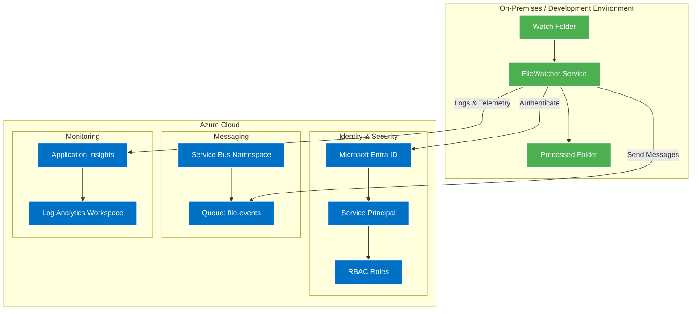

# FileWatcher Application Architecture

## Overview
The FileWatcher application is a distributed system that monitors a directory for new files, processes them, and sends the file data through Azure Service Bus. The application uses modern cloud-native patterns and Microsoft Entra ID (Azure AD) for security.

## Getting Started

### Prerequisites
1. Azure subscription
2. Terraform installed
3. PowerShell 7+ installed
4. .NET 7.0 SDK installed

### Setup Steps
1. Deploy Azure Infrastructure:
   ```bash
   cd terraform
   terraform init
   terraform apply
   ```

2. Configure Application Settings:
   ```powershell
   # From the terraform directory
   .\get-settings.ps1
   ```
   This script will:
   - Retrieve sensitive values from Terraform state
   - Update both services' appsettings.json files with:
     - Application Insights connection string
     - Service Bus namespace and queue name
     - Azure AD credentials (unique for each service)
   - Preserve other settings like file paths and filters

3. Create required folders:
   ```powershell
   # Create folders for file processing
   mkdir C:\Temp\WatchFolder
   mkdir C:\Temp\ReceiveFolder
   ```

## Architecture Diagram


## Component Details

### FileWatcher Service
- **.NET Worker Service**: Long-running background service
- **File System Watcher**: Monitors specified directory for new files
- **File Processing**: Reads file content and creates structured messages
- **Message Publishing**: Sends file data to Azure Service Bus queue
- **File Management**: Moves processed files to a processed folder

### Azure Resources

#### Identity & Security
- **Microsoft Entra ID (Azure AD)**
  - Application Registration for FileWatcher
  - Service Principal for authentication
  - RBAC role assignments for Service Bus access

#### Messaging
- **Azure Service Bus**
  - Standard tier namespace
  - Queue: "file-events"
  - Partitioning enabled for scalability
  - 14-day message TTL

#### Monitoring
- **Application Insights**
  - Application performance monitoring
  - Custom telemetry
  - Distributed tracing
- **Log Analytics Workspace**
  - Centralized logging
  - Query and analysis capabilities
  - 30-day retention

### Security Implementation

#### Authentication
- Service Principal authentication using ClientSecretCredential
- No connection strings stored in configuration
- Secrets managed through Azure AD

#### Authorization
- RBAC (Role-Based Access Control)
- Minimum required permissions:
  - Azure Service Bus Data Sender role on queue

### Message Flow
1. File created in watch folder
2. FileWatcher Service detects new file
3. File content read and structured
4. Service authenticates with Azure AD
5. Message sent to Service Bus queue
6. File moved to processed folder
7. Operation logged to Application Insights

### Infrastructure as Code
- **Terraform** manages all Azure resources:
  - Resource Group
  - Service Bus Namespace and Queue
  - Application Insights
  - Log Analytics Workspace
  - Azure AD Application and Service Principal
  - RBAC Role Assignments

## Configuration
```json
{
  "ServiceConfig": {
    "WatchFolder": "Path to monitored directory",
    "FileFilter": "File pattern to watch"
  },
  "ServiceBusConfig": {
    "FullyQualifiedNamespace": "servicebus.windows.net",
    "QueueName": "file-events"
  },
  "AzureAd": {
    "ClientId": "Application ID",
    "ClientSecret": "Secret for authentication",
    "TenantId": "Azure AD tenant ID"
  }
}
```

## Monitoring and Logging
- Structured logging with Serilog
- Application Insights integration
- Operation correlation with unique IDs
- File processing metrics and events
- Service Bus operation tracking

## Error Handling
- Retry logic for transient failures
- Exception logging with context
- Failed operation tracking
- File processing state management

## Scalability
- Service Bus partitioning enabled
- Independent processing of messages
- Configurable message TTL
- Resource scaling through Terraform

## Future Enhancements
1. Add Azure Key Vault integration for secret management
2. Implement message session handling for ordered processing
3. Add dead-letter queue handling
4. Implement file content validation
5. Add support for different file types
6. Implement message batching for performance
7. Add message consumer (Azure Function) for processing queue messages
